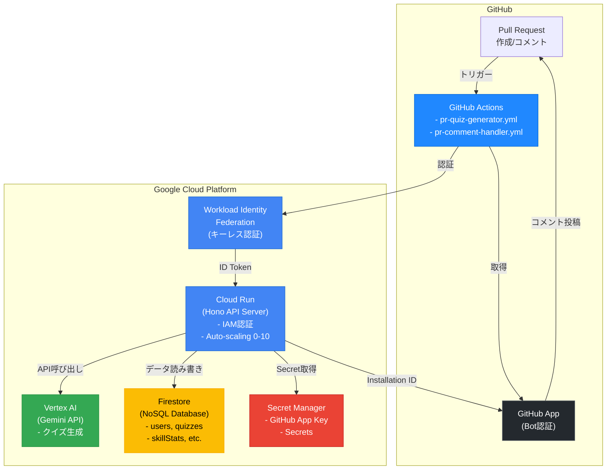
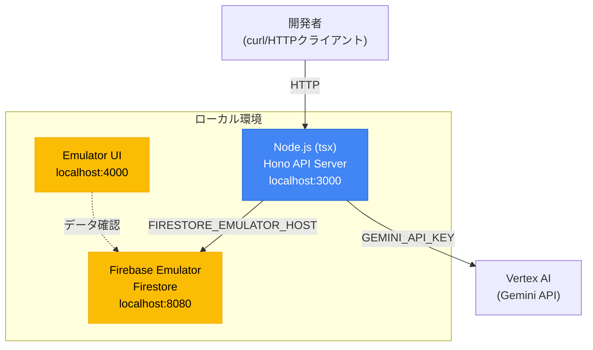
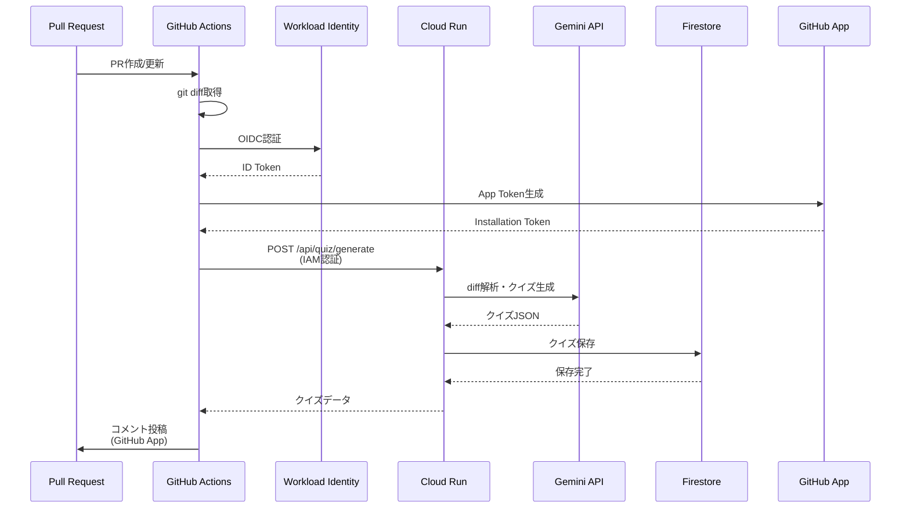
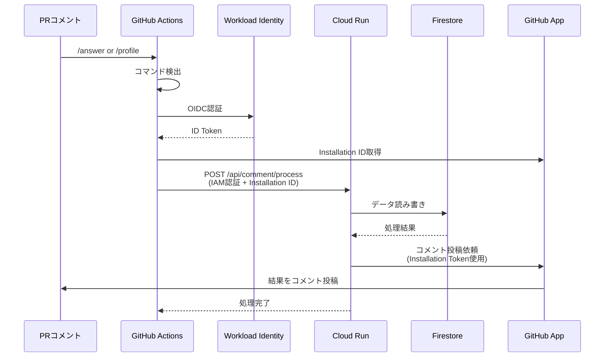
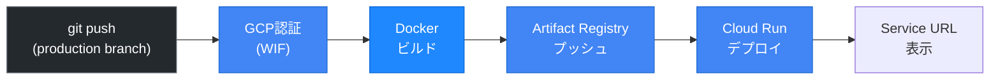

# MR/PR Quiz Bot - システムアーキテクチャ

PR/MRからAIがクイズを生成し、開発者のスキル成長を支援するシステム

---

## システム構成図

### 本番環境（Google Cloud + GitHub Actions）



### ローカル開発環境



---

## インフラコンポーネント

### 1. GitHub Actions（トリガー・連携層）

**役割**: PR/コメントイベントの検知、Cloud Run呼び出し、結果投稿

**ワークフロー**:

#### `pr-quiz-generator.yml`（PR作成時）
1. PR作成・更新時にトリガー
2. Workload Identity FederationでGCP認証
3. PR差分（git diff）を取得
4. Cloud Run `/api/quiz/generate` にIAM認証付きでリクエスト
5. GitHub Appトークンでクイズをコメント投稿

#### `pr-comment-handler.yml`（コメント時）
1. PRコメント作成時にトリガー
2. `/answer` または `/profile` コマンドを検出
3. Workload Identity FederationでGCP認証
4. Cloud Run `/api/comment/process` にIAM認証付きでリクエスト
5. Cloud Run側がGitHub Appでコメント投稿

#### `deploy.yml`（デプロイ）
1. `production` ブランチへのプッシュでトリガー
2. Dockerイメージをビルド・Artifact Registryにプッシュ
3. Cloud Runにデプロイ

### 2. Workload Identity Federation（認証基盤）

**役割**: GitHubとGCPのキーレス認証

**メリット**:
- サービスアカウントキーの管理不要
- セキュアな認証フロー
- GitHub Actions → Cloud Runの直接呼び出し

**認証フロー**:
```
GitHub Actions → OIDC Token → WIF → GCP ID Token → Cloud Run
```

### 3. GitHub App（Bot認証）

**役割**: PRへのコメント投稿権限

**権限**:
- `pull-requests: write`（コメント投稿）
- `contents: read`（リポジトリ読み取り）

**認証方式**: JWT + Installation Token

### 4. Cloud Run（APIサーバー）

**役割**: REST APIの提供、ビジネスロジックの実行

**主要エンドポイント**:
- `POST /api/quiz/generate` - クイズ生成
- `POST /api/comment/process` - コメントコマンド処理
- `PUT/GET /api/users/:id/profile` - プロファイル管理
- `GET /api/users/:id/skills` - スキル統計
- `GET /api/analytics/team` - チーム分析

**技術スタック**:
- Runtime: Node.js 22+
- Framework: Hono（軽量Webフレームワーク）
- Language: TypeScript
- Validation: Zod

**スケーリング**:
- Min instances: 0（コスト削減）
- Max instances: 10
- CPU: 1vCPU
- Memory: 512MB
- Timeout: 60秒

**認証**: IAM認証（`--no-allow-unauthenticated`）

### 5. Firestore（データストア）

**役割**: NoSQLデータベース、リアルタイムデータ同期

**コレクション構成**:

| コレクション | 説明 | 主要フィールド |
|-------------|------|---------------|
| `users` | ユーザー基本情報 | accountId, platform, totalQuizzes, correctCount |
| `userProfiles` | プロファイル情報 | careerGoal, experienceLevel, focusAreas |
| `quizzes` | クイズデータ | questionText, category, difficulty, options, correctAnswerIndex |
| `answers` | 回答履歴 | quizId, accountId, selectedAnswerIndex, isCorrect |
| `mergeRequests` | PR/MRメタデータ | platform, owner, repo, number, title |
| `skillStats` | スキル統計 | categoryStats, averageDifficulty, growthTrend |
| `growthMilestones` | 成長マイルストーン | milestoneType, category, achievedAt |
| `teamAnalytics` | チーム分析 | period, totalQuizzes, averageAccuracy |

**データ量見積もり**:
- 1日100PR × 1クイズ = 100 quizzes/day
- 月間: ~3,000 documents（無料枠: 50,000 reads/day）

### 6. Vertex AI（Gemini API）

**役割**: AI駆動のクイズ生成、パーソナライズ

**使用モデル**: Gemini 1.5 Pro（構造化出力対応）

**主要処理**:
- PR差分からクイズ生成
- カテゴリ自動分類（bug_fix, performance, refactoring, security, logic）
- 難易度自動判定（easy, medium, hard）
- パーソナライズプロンプト（苦手分野優先、目標分野重視）

**コスト見積もり**:
- 1リクエスト: ~$0.001
- 月間100PR: ~$3

### 7. Secret Manager

**役割**: 機密情報の安全な管理

**管理対象**:
- `bot-app-id`: GitHub App ID
- `bot-app-private-key`: GitHub App 秘密鍵（PEM形式）
- `webhook-secret`: Webhook署名検証用（レガシー・互換性維持）

**アクセス制御**: Cloud RunサービスアカウントにIAM権限付与

---

## 処理フロー

### クイズ生成フロー（PR作成時）



### コマンド処理フロー（コメント時）



---

## デプロイメント

### CI/CD パイプライン（GitHub Actions）



**トリガー**:
- `production` ブランチへのプッシュ
- または手動実行（`workflow_dispatch`）

**デプロイ設定**:
- Service名: `mr-quiz-api`
- Region: 環境変数で指定
- IAM認証有効（`--no-allow-unauthenticated`）
- Secret Managerから環境変数注入

**認証**: Workload Identity Federation（キーレス認証）

---

## セキュリティ

### 認証・認可

| 項目 | 実装方式 |
|-----|---------|
| GitHub → Cloud Run | Workload Identity Federation（OIDC）+ IAM認証 |
| GitHub App認証 | JWT + Installation Token |
| Secret管理 | Google Secret Manager（IAM権限制御） |
| Rate Limiting | `hono-rate-limiter`（100 req/min） |

**認証フロー**:
1. GitHub Actions: OIDC TokenをWIFに提示
2. WIF: GCP ID Tokenを発行
3. Cloud Run: ID TokenでIAM認証
4. Cloud Run → GitHub App: Installation Tokenで認証

### ネットワーク

- Cloud Run: HTTPSのみ（TLS 1.2+）、IAM認証必須
- Firestore: Private Google Network
- Secret Manager: IAM権限制御（Cloud Runサービスアカウントのみアクセス可）
- Artifact Registry: プライベートレジストリ

### セキュリティのポイント

- ✅ **キーレス認証**: サービスアカウントキーを使用せずWIF経由で認証
- ✅ **最小権限の原則**: 各サービスアカウントに必要最小限の権限のみ付与
- ✅ **Secret分離**: GitHub App秘密鍵はSecret Managerで管理
- ✅ **IAM認証**: Cloud Runは外部から直接アクセス不可（GitHub Actions経由のみ）

---

## コスト見積もり（月間100PR想定）

| サービス | 無料枠 | 想定コスト |
|---------|--------|----------|
| Cloud Run | 2M requests/month | **$0**（無料枠内） |
| Firestore | 50K reads/day | **$0**（無料枠内） |
| Vertex AI (Gemini) | - | **~$3** |
| Secret Manager | 10K accesses/month | **$0**（無料枠内） |
| Artifact Registry | 0.5GB storage | **$0**（無料枠内） |
| GitHub Actions | 2,000分/月（Public repo） | **$0**（無料枠内） |
| **合計** | | **~$3/月** |

**コスト削減のポイント**:
- Cloud Run: Min instances=0（使用時のみ課金）
- Firestore: 無料枠内で運用可能（月間150万オペレーション）
- GitHub Actions: パブリックリポジトリは無料

---

## 監視・運用

### ロギング

- **Cloud Logging**: 全APIリクエスト・レスポンスをログ記録
- **構造化ログ**: JSON形式（`src/utils/logger.ts`）

### モニタリング

- **Cloud Monitoring**: レイテンシ、エラー率、リクエスト数
- **Uptime Checks**: `/health` エンドポイント監視

### アラート（推奨設定）

- エラー率 > 5%
- レスポンスタイム > 3秒
- Quota超過警告

---

## 拡張性・将来計画

### スケーラビリティ

| 項目 | 現在 | 拡張後 |
|-----|-----|--------|
| 同時PR処理 | 10 | 100+（Cloud Runインスタンス増） |
| データ量 | ~10万doc/年 | ~数百万doc/年（BigQueryエクスポート検討） |
| ユーザー数 | ~100 | ~10,000+（Firestoreスケールアウト） |

### 今後の機能追加

- **GitLab対応**: GitLab CI経由でCloud Run呼び出し
  - `.gitlab-ci.yml` でクイズ生成
  - GitLab API でコメント投稿
- **Looker Studioダッシュボード**: Firestore → BigQuery連携
- **クイズスキップ・リマインド機能**: 回答期限管理
- **Multi-tenancy**: 複数組織対応（組織ごとのFirestoreコレクション分離）

### レガシー機能（後方互換性維持）

以下の機能は後方互換性のために残されていますが、推奨されません：

- `POST /api/webhook/github`: 直接Webhookを受信する方式（GitHub Actions経由を推奨）
- `POST /api/webhook/gitlab`: GitLab Webhook（未実装）
- Webhook署名検証ミドルウェア（IAM認証を推奨）

**移行済み**:
- ~~Webhook方式~~ → **GitHub Actions + IAM認証** ✅
- ~~GitHub App JWTでコメント投稿~~ → **GitHub Actions経由でコメント投稿** ✅
